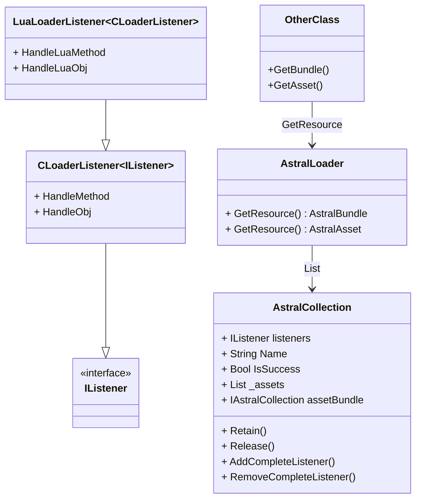

```mermaid
classDiagram
    class AstralLoader {
        + GetResource() AstralBundle
        + GetResource() AstralAsset
    }
    class AstralCollection {
        + IListener listeners
        + String Name
        + Bool IsSuccess
        + List<Object> _assets
        + IAstralCollection assetBundle
        + Retain()
        + Release()
        + AddCompleteListener()
        + RemoveCompleteListener()
    }

    class IListener {
        <<interface>>
    }
    class CLoaderListener~IListener~ {
        + HandleMethod
        + HandleObj
    }
    CLoaderListener--|> IListener
    class LuaLoaderListener~CLoaderListener~ {
        + HandleLuaMethod
        + HandleLuaObj
    }
    LuaLoaderListener--|> CLoaderListener
    class OtherClass{
        +GetBundle()
        +GetAsset()
    }
    OtherClass --> AstralLoader : GetResource
    AstralLoader-->AstralCollection : List<Object>
```