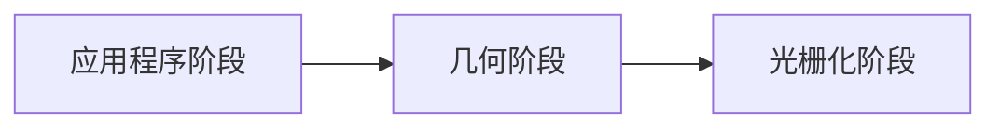
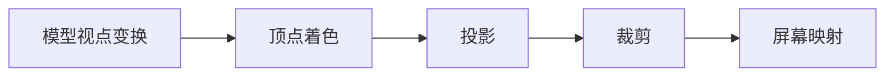
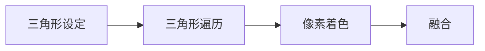
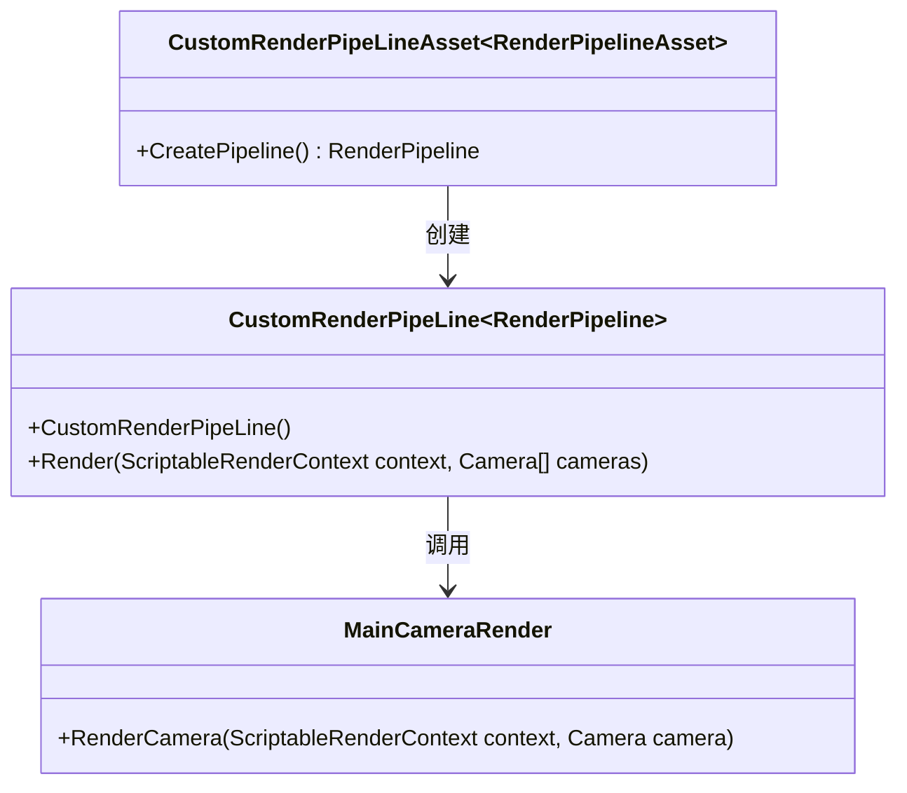

[TOC]

## 渲染管线

渲染管线的几个基本流程

### 应用程序阶段

> 计算机CPU的处理，包含CPU传递内容到`VRAM`(显存)

### 几何阶段

> 基本都是对顶点的处理

- 模型视点变换
> 将模型自身坐标转换到视觉空间坐标
> 
> 借助`《real-time rendering》`的图

- 顶点着色
> 
- 投影
> 
- 裁剪
> 超出视觉空间的进行裁剪
- 屏幕映射
> 映射到屏幕空间

### 光栅化阶段

- 三角形设定
- 三角形遍历
- 像素着色
- 融合

## Unity的自定义管线

### Unity 自定义管线的构建（以urp为例）

### unity 自定义管线的基本流程

如果上图失败

## Unity Shader HLSL的基本语法

### 基本的shader结构

### Shader变量

### Shader的方法

### Shader的特性(shader_feature)

### Shader的Property声明

### Shader Property的前置标签

### Shader展示界面(ShaderGui)
