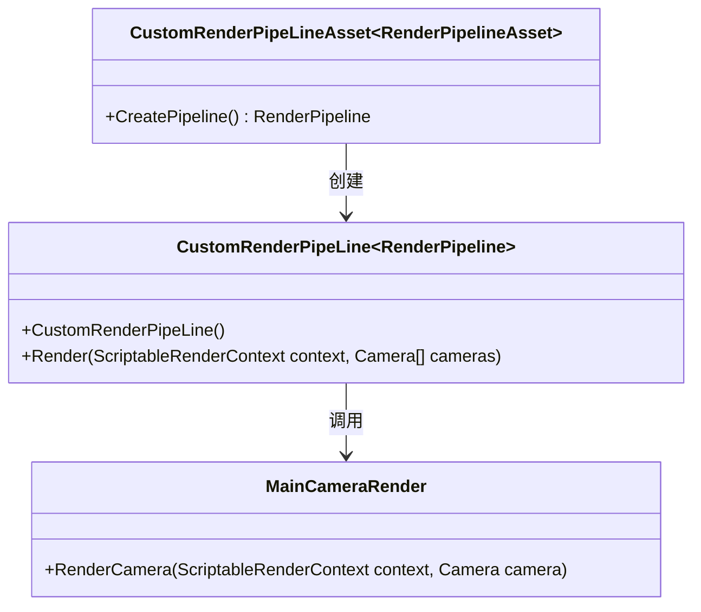

[TOC]

## Unity的自定义管线

### Unity 自定义管线的构建（以urp为例）

### unity 自定义管线的基本流程

如果上图失败

## Unity Shader HLSL的基本语法

### 基本的shader结构

### Shader变量

### Shader的方法

### Shader的特性(shader_feature)

### Shader的Property声明

### Shader Property的前置标签

### Shader展示界面(ShaderGui)
