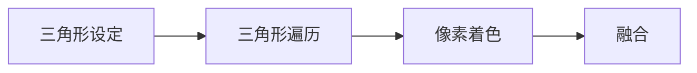
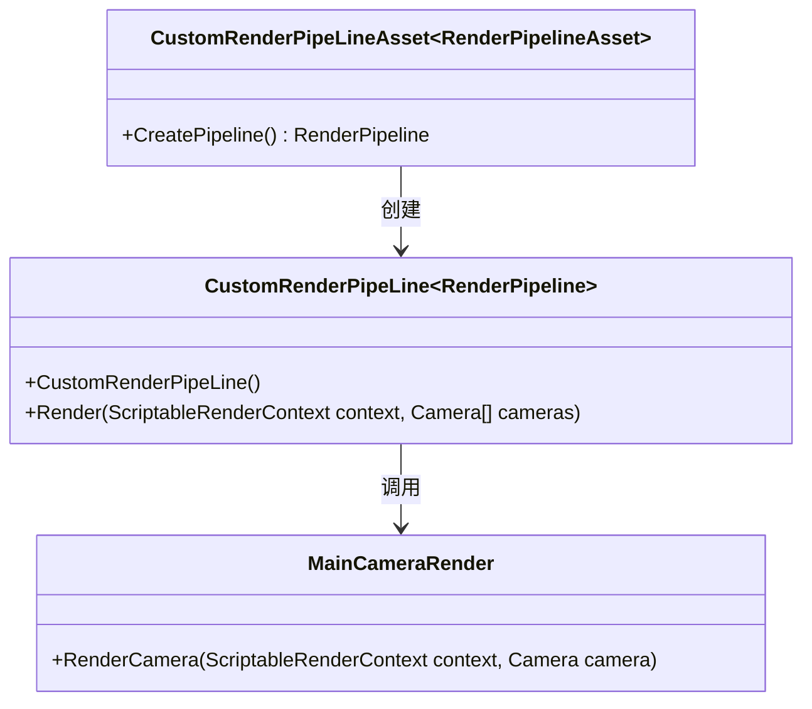

[TOC]

## 渲染管线

渲染管线的几个基本流程


### 应用程序阶段

> 计算机CPU的处理，包含CPU传递内容到`VRAM`(显存)

### 几何阶段

> 基本都是对顶点的处理


- 模型视点变换
> 将模型自身坐标转换到视觉空间坐标
> 
> 借助`《real-time rendering》`的图

- 顶点着色
> 
- 投影
> 
- 裁剪
> 超出视觉空间的进行裁剪
- 屏幕映射
> 映射到屏幕空间

### 光栅化阶段



- 三角形设定
- 三角形遍历
- 像素着色
- 融合

## Unity的自定义管线

### Unity 自定义管线的构建（以urp为例）


### unity 自定义管线的基本流程



如果上图失败


## Unity Shader HLSL的基本语法

### 语法

#### 类型

##### `hlsl`自带(或者第三方定义)的***基本类型***（*urp,lwrp,hdrp,core pipleline*等等）
- `float4`
- `real4`
- `float`
- `……`

##### 开发者自定义的类型

在cpu gpu 的ram vram上的数据类型

`hlsl`比较常用的自定义类型结构通常是`struct`

常见的自定义类型格式如下

```
struct 你自定义类型的名称 {
	// 这里可以声明类型里面包含的内容
    // 比如
    float3 position:POSITION;
    // POSITION是hlsl的语义，还有其他的！
}
```

> `POSITION`之类的语义,在shader里通常是用在管线中限定输入值的来源、输出值的去向！
> | 名称 | 说明 |
> | -- | -- |
> | POSITION | 模型的顶点坐标 |
> | TEXTUREn | 模型空间中第n组纹理坐标 |
> | NORMAL | 模型空间中的法线方向 |
> | COLOR | 模型空间中顶点的颜色 |
> | SV_POSITION | 裁剪空间中的顶点坐标 |
> |COLORn | 输出第n组顶点颜色 |
> |TEXCOORDn | 输出第n组纹理坐标 |
> |SV_Target | 输出值存储到渲染目标中|


在现实生活中，生物是按照 `界门纲目科属种` 来分类的，hlsl的自定义类型就像是开发者创造了一个`生物种`，比如我们创造一个猫的种类：

```
struct bo_si_mao {
	// 这里可以声明类型里面包含的内容
    tou mao_tou;
    weiba mao_wei;
}
```

`bo_si_mao`就是一个猫的种类，我们平时养猫的时候都会给猫起一个名字，比如`kitty`、`tom`之类的，如果我们需要确定一只`bo_si_mao`叫做`kitty`就需要声明(我们管这一步叫做对象声明):

```
bo_si_mao kitty;
```

这样的话，我就有一只叫做`kitty`的`bo_si_mao`，`kitty`这个名字和现在样的具体某一只`bo_si_mao`对应了，如果我们有2只`bo_si_mao`,在我们需要说到某一只`bo_si_mao`的头的时候， 怎么明确是哪一只呢？不错，就是通过对每一只`bo_si_mao`进行命名，一个叫`kitty`、一个叫`tom`;如果说`kitty`的`猫头`, 我们就能找到对应具体的猫,以及访问它的`猫头`了；

```
bo_si_mao kitty;
bo_si_mao tom;

// 摸猫头
摸kitty.mao_tou;
```

##### 有效性

我们自定义的类型、对象声明都是具有区域有效性的，即超出这个区域，里面定义的类型就不能直接使用了!通常来讲，我们一般指的是`Pass`里，跳出一个`pass`的话，自定义的类型需要重新定义;

声明的对象都是基于`{}`这个符号的，一旦跳出这个`{}`，声明的对象就不在是我们之前使用的那个对象（物体）

比如我自家里有一只叫做`kitty`的猫，朋友A的也有一只叫`kitty`的猫， 都是叫`kitty`，但是在我家指的是我家的猫，在朋友A家里确实朋友A的猫，那是两只不同的猫


也许你会杠，说如果我把朋友A的`kitty`猫,带回我家呢？答案是，系统也懵逼，不知道`kitty`到底是哪只猫(只能报错了~)！那有没有办法呢？当然是有啦，不过后面讲`方法`的时候讲!


### 基本的shader结构

```
Shader "CustomRP/你喜欢叫什么就叫什么"
{
    Properties
    {
    	// 对材质球开放的参数
    }
    SubShader
    {
    	Tag{}
    	// pass可以有多个
    	Pass{
            // cg的
    		//CGProgram
    		//EndCGProgram
    		
    		// 或者hlsl
    		HLSLPROGRAM
    		#pragma vertex LitPassVertex
			#pragma fragment LitPassFragment
            // 具体逻辑
    		ENDHLSL
    	}
    	
    }
    fallback ""
    cunstomEditor ""
}
```

- #pragma

编译指示使用的，常用的有`target`、`shader_feature`、`vertex`、`fragment`

> `target`指定运行平台 `#pragma target 3.5`
> 
> `shader_feature`特征
> 
> `vertex`声明顶点着色器执行的方法;`#pragma vertex LitPassVertex`,`LitPassVertex`就是顶点着色器的入口，这个名称可以自定义，但是必要有次方法，后面方法会讲到方法的声明
>
> `fragment`声明顶点着色器执行的方法;`#pragma fragment LitPassFragment`,`LitPassFragment`就是片元着色器的入口，这个名称可以自定义，但是必要有次方法，后面方法会讲到方法的声明

- #include

引入文件库，这里引入的文件，有效范围仅仅只是在`CGProgram`(`HLSLPROGRAM`)和`EndCGProgram`(`ENDHLSL`)之间;

### Shader变量

```
类型名称 变量名;
```

比如

- `float3 f3;`

- `bo_si_mao kitty;`

#### Shader变量的使用

在声明变量后,我们可以通过变量的名称访问到里面的内容，比较我家那个叫`kitty`的猫的猫头

```
kitty.mao_tou;
```

如果每次说到`我家那个叫kitty的猫的猫头`，都需要打那么长的说明，挺不爽的；就像讲话一样，用上下文就能直接使用`猫头`代表`我家那个叫kitty的猫的猫头`，在shader里也能这么干

```
类型 名称 = kitty.mao_tou
```

这里说得`类型`必须和`kitty.mao_tou`的类型一样，回去看看`bo_si_mao`的类型声明，我们知道`mao_tou`的类型是`tou`，所以正确的写法是

```
tou 猫头 = kitty.mao_tou
```

通用结构就是

```
类型 名称 = 变量名称.属性名称（不是属性类型）
```

### Shader的方法

#### 方法的声明

方法的定义声明格式大致是下面的格式

```
返回类型 方法名称(传进来的参数){
	// 自定义执行的逻辑
	return 返回指定类型的变量
}
```

- 返回类型

方法执行完成后需要反馈给调用者的！

> 如果`调用者`需要的是一个`float3`的类型的,``return float2(1,1)``就会报错;

`返回类型` 可以是自定义的，具体类型可以回顾前面说得`类型`;

> 也有比较特殊的，如：`void` 代表什么都不用返回;


再比如
```
struct Attributes {
	float3 positionOS : POSITION;
};
struct Varyings {
	float4 positionCS : SV_POSITION;
};

Varyings LitPassVertex (Attributes input)  {
    Varyings output;
	output.positionCS = input.positionOS;
	return output;
}
```

方法`LitPassVertex`需要返回的是一个类型为`Varyings`的变量;传入的参数是一个类型为`Attributes`的变量;

- 传进来的参数

```
返回类型 方法名称((可以多个)[类型 名称]){
	// 自定义执行的逻辑
	return 返回指定类型的变量
}
```

`类型` 可以是自定义的，具体类型可以回顾前面说得`类型`;

`名称`有限制的,这个可以自行百度，但是有一点要注意的，千万不要有`.`;

- 返回指定类型的变量

> 这里要说明一下，这里的变量的类型必须要和方法声明的`返回类型`一样！否则会报错!
> 
>> 也可以强行转换，这个就不在这里多做说明:（eg:`Varyings output=(Varyings)0;`）
>> 

#### 方法的调用

- 无返回的方法

```
方法名称(参数);
```

- 有返回的方法

```
返回类型 返回变量的名字 = 方法名称(参数);
```

`返回类型`就是前面`方法声明`里说的`返回类型`

`返回变量的名字`只是方法返回的内容的一个名称，类似`kitty`;

```
Pass{
    float MethodOne()
    {
    	float a=10;
    	float b=a*a;
    	return b;
    }
    float MethodTwo(float a)
    {
    	float b=a*a;
    	return b;
    }
    
    // 第一个执行的方法
    void main(){
        // 调用MethodOne()  计算10的平方
        float tensq = MethodOne();
        MethodOne();
         // 调用MethodTwo(x)  计算x的平方
        float tensq1 = MethodTwo(20);
        MethodTwo(30);
        //return 
    }
}
```

到了这里，我们回到前面说得`如果我把朋友A的kitty猫,带回我家呢？`这个问题了，如果我们把从朋友A家抱回来的`kitty`猫，这种行为变成一个方法

```
bo_si_mao 抱猫回家(房子 朋友A的房子)
{
    return 朋友A的房子.kitty
}
```

通过`抱猫回家`这个方法，我们就能把`朋友A`的`kitty`包回家了

```
void 我开始行动()
{
    bo_si_mao kitty;
    房子 朋友房子;
    bo_si_mao tom = 抱猫回家(朋友房子);
}
```

把猫抱回家后，我们重新命名为`tom`了，这样我在自己家里的时候，我自己的猫还是叫`kitty`,但是`朋友A`家的`kitty`就叫做`tom`了，这样我们不会懵逼，系统也能区别!


#### 强转换类型

```
Varyings output=(Varyings)0;
```

比如有两个类型
`bo_si_mao`
和
`bo_si_gou`
```
bo_si_gou(float) gouA=0;

bo_si_mao maoA = (bo_si_mao )gouA;
```

### Shader的特性(shader_feature)

### Shader的Property

```
[前置标签] 名称 (材质上展示的名称, 类型)=默认值
```
eg:

`[MainTexture] _BaseMap("Texture", 2D) = "white" {}`

#### Property类型

unity提供了一些资源的类型，这里就罗列一些比较常用的

| 类型 | 说明 |
| -- | -- |
| 2D | 2d纹理 |
| Color | 颜色 |
| Vector | 向量(4个小数) |
| Float | 单个小数 |
| CUBE | CUBE |

### Shader Property的前置标签

[link]()

### Shader展示界面(ShaderGui)

[link]()