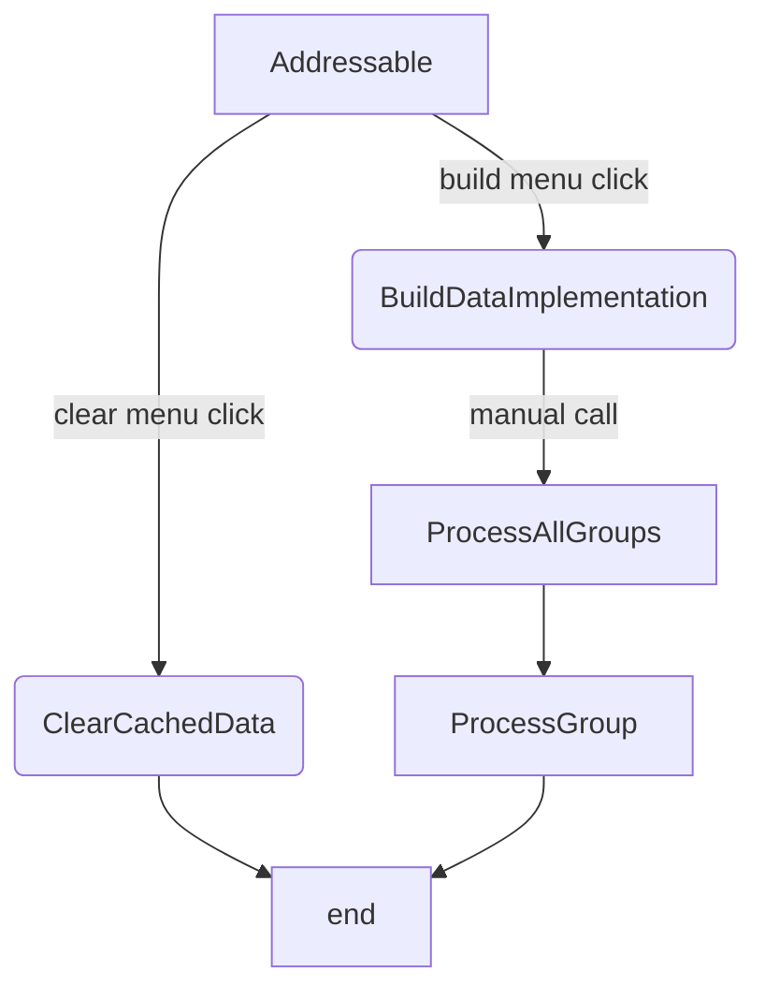

[TOC]

## BuildScriptBase

> `BuildScriptBase`是给`Editor`使用的，并不是打包后在目标平台上用的。

### 大体流程

先看看`BuildScriptBase`的大体流程图，这样后面讲代码还能知道怎么回事!




> 继承`BuildScriptBase`需要重写一下几个方法

### Name

> 通过修正这个名称展示在`settings`中

> 

### CanBuildData

> 该方法是判定是否是build的时候使用的，在addressable的时候，会传入`AddressablesPlayerBuildResult`给扩展类型
>
> `AddressablesPlayModeBuildResult`代表的是`play mode`

> 一般是通过下面的这种方式来判定

> ```c#
> // build
> return typeof(T).IsAssignableFrom(typeof(AddressablesPlayerBuildResult));
> ```

> ```c#
> // play
> return typeof(T).IsAssignableFrom(typeof(AddressablesPlayModeBuildResult));
> ```

### BuildDataImplementation

> 该方法是执行打包的时候，具体执行的操作;
> 
> 通过流程图，我们知道这个方法是在我们打包的时候调用的。

### ProcessAllGroups

> 处理所有的`Groups`

### ProcessGroup

> 处理指定的`Groups`

### ClearCachedData

> 该方法是执行本地发布资源清理时调用的

### IsDataBuilt

> 未知


## Play Mode Script

`addressable` play模式使用的是`BuildScriptBase`作为基类的,最简单的构建大致如下

```c#
using UnityEditor.AddressableAssets.Build;
using UnityEngine;
using UnityEditor.AddressableAssets.Build.DataBuilders;

namespace WDFramework
{
	/// <summary>
	/// 自定义的editor模式下的play扩展模式
	/// </summary>
	[CreateAssetMenu(fileName = "AstralPackedPlayMode.asset", menuName = "Addressables/Content Builders/Use Astral Build (requires built groups)")]
	public class AstralPackedPlayMode : BuildScriptBase
	{
		/// <summary>
		/// 名称，这个必须要定义，否则会在settings里展示未定义
		/// </summary>
		public override string Name
		{
			get
			{
				return "Use Astral Build (requires built groups)";
			}
		}
		/// <summary>
		/// addressable通过判定T是不是AddressablesPlayModeBuildResult来分辨是play还是build
		/// </summary>
		/// <typeparam name="T">类型</typeparam>
		/// <returns>是不是build数据</returns>
		public override bool CanBuildData<T>()
		{
			// play必须是AddressablesPlayModeBuildResult
			return typeof(T).IsAssignableFrom(typeof(AddressablesPlayModeBuildResult));
		}
	}
}
```

### 如何应用

`Build Script`和`Play Mode Script`的使用方式是差不多的，首先我们需要在`AddressableAssetsData/DataBuilders`(你也可以放在其他assetDatabase能找到的地方，但建议还是放在这里)中创建它们的`asset`


创建完成后


然后在`AddressableAssetSettings` -> `Build and Play Mode Scripts`里添加新创建的`asset`即可


然后我们打开`Addressable Group`就能在`Play Mode Scrip`和`Build`中看到我们定义的mode了


## Build Script

`addressable` build模式使用的是`BuildScriptBase`作为基类的,最简单的构建大致如下

```c#
using UnityEditor.AddressableAssets.Build;
using UnityEditor.AddressableAssets.Build.DataBuilders;
using UnityEngine;

namespace WDFramework
{
	/// <summary>
	/// 自定义的editor模式下build的扩展模式
	/// </summary>
	[CreateAssetMenu(fileName = "AstralPacked.asset", menuName = "Addressables/Content Builders/Astral Build Script")]
	public class AstralPackedMode : BuildScriptBase
	{
		/// <summary>
		/// 名称，这个必须要定义，否则会在settings里展示未定义
		/// </summary>
		public override string Name
		{
			get
			{
				return "Astral Build Script";
			}
		}
		/// <summary>
		/// addressable通过判定T是不是AddressablesPlayerBuildResult来分辨是play还是build
		/// </summary>
		/// <typeparam name="T">类型</typeparam>
		/// <returns>是不是build数据</returns>
		public override bool CanBuildData<T>()
		{
			return typeof(T).IsAssignableFrom(typeof(AddressablesPlayerBuildResult));
		}
	}
}
```

> 应用的方式已经在上文中说明，这里就不在多做说明了。