[TOC]

## CustomAssetDatabasePlayMode创建

playMode是在Editor下使用的，用于指定加载的模式的，所以我们需要在Editor下创建就可以了

```c#
/// <summary>
/// 自定义assetdatabase模式
/// </summary>
[CreateAssetMenu(fileName = "CustomDatabasePlayMode.asset",
	menuName = "Addressables/Content Builders/Use custom database")]
public class CustomAssetDatabasePlayMode : BuildScriptBase
{
}
```
## CustomAssetDatabasePlayMode 设置

`BuildScriptBase`有几个很重要的属性和方法需要覆盖重写的，下面简单说几个

- Name

> 这个是必须要重写的，只有重写了名称才能在菜单中更好定位

```c#
public override string Name => "Use custom database";
```

- CanBuildData

> 因为需要的是在play中使用，并不是打包资源使用的，所以按照以下指定

```c#
public override bool CanBuildData<T>()
{
	return typeof(T).IsAssignableFrom(typeof(AddressablesPlayModeBuildResult));
}
```

- BuildDataImplementation

> 在这个mode启动的时候，`addressable`会执行此方法，

```c#
protected override TResult BuildDataImplementation<TResult>(AddressablesDataBuilderInput builderInput)
{
    return default;
}
```

其他的请参考 [link]()


## addressable在Editor的启动流程

```mermaid
graph TB;
    A[Play Unity]
    B[BuildScriptBase]
    C[BuildScriptBase buidData]
    C1[create setting.json]
    C2[create catalog.json]
    D[AddressableImp]
    E[load Setting.json]
    F[parse setting.json]
    G[load catalog.json]
    H[End]
    A-->B
    B-->C
    C-->D
    D-->E
    E-->F
    F-->G
    G-->H
    C-->C1
    C-->C2
```



通过上述的流程图我们知道，`Addressable`在运行时是需要要两个文件`setting.json`和`catalog.json`的，这两个文件大致说明如下:

### setting.json

`addressable`第一时间解释的文件,记录以下内容

- catalog.json路径；
- catalog的解释器,provider一般是`ContentCatalogProvider`；

> setting.json 的读取是
优先从`PlayerPrefs`的 `Addressables.kAddressablesRuntimeDataPath`中读取，其次就是从`RuntimePath + "/settings.json"`
> 
> 加载`setting.json`后，将其解释为`ResourceManagerRuntimeData`类型;
> 
> 更加详细的内容可以去查阅`Addressable`的`ResourceManagerRuntimeData`
> 
> 读取完成后就开始加载`catalog.json`

### catalog.json

其内容和以前`assetbundle`的`manifest.xml`意义差不多，记录一下内容

- 加载使用的`key`
- 内容解释器，所有的`provider`
- 资源依赖

> 加载`catalog.json`后，将其解释为`ContentCatalogData`类型;
> 更加详细的内容可以去查阅`Addressable`的`ContentCatalogData`


## CustomAssetDatabasePlayMode的详细扩展

> 通过上面的普及，对于`BuildScriptBase`需要构建的几个文件都清楚了，那么下面就开始构建这两个文件；

### setting.json 的创建
由于`setting.json`是`ResourceManagerRuntimeData`类型，所以在`BuildDataImplementation`方法里添加一下方法

```c#
protected override TResult BuildDataImplementation<TResult>(AddressablesDataBuilderInput builderInput)
{
    var settingJson = new ResourceManagerRuntimeData();
}
```
创建完成`settingJosn`对象后，需要对其进行一些简单的设置

- 平台设定

```c#
settingJson.BuildTarget = builderInput.Target.ToString();
```

- Profile

```c#
// 因为是editor，直接开启
settingJson.ProfileEvents = true;
```

- Catalog.json位置

```c#
var PathFormat = "{0}/Library/com.unity.addressables/{1}.json";
var catalogPath = string.Format(PathFormat, "file://{UnityEngine.Application.dataPath}/../", "catalog");
settingJson.CatalogLocations.Add(new ResourceLocationData(new []{ResourceManagerRuntimeData.kCatalogAddress}, catalogPath, typeof(ContentCatalogProvider), typeof(ContentCatalogData)));
```

- 保存`Setting.json`

```c#
var settingsPath = string.Format(PathFormat, Path.Combine(Application.dataPath, "/../"), "setting");
WriteFile(settingsPath, JsonUtility.ToJson(settingJson), builderInput.Registry);
```

然后我们启动unity后，会发现在`Library/com.unity.addressables`下多了一个`setting.json`的文件

上文已经提到过`Setting.json`是优先从`PlayerPrefs`中找它的路径的，所以我们在Editor下需要简单设置一下，使得在editor下也能直接读取我们指定的文件

```c#
var runtimeSettingsPath = string.Format(PathFormat, "file://{UnityEngine.Application.dataPath}/../", "settings");
PlayerPrefs.SetString(Addressables.kAddressablesRuntimeDataPath, runtimeSettingsPath);
```

上文经常使用到的`file://{UnityEngine.Application.dataPath}`是addressable内用的相对路径

### catalog.json 的创建


### Group的处理
### 添加时间监听