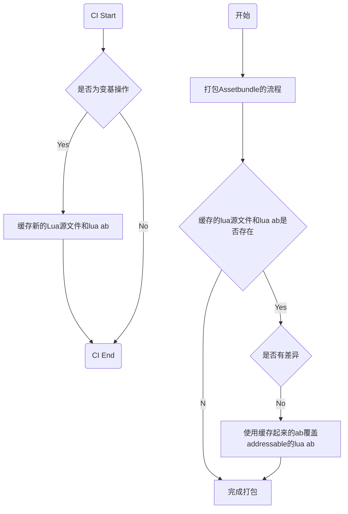

## 背景

目前使用的`lua`代码文件都是进过了`Luajit`生成的`bytes文件`,而且因为是动态生成，而且是难以直接修改，所以项目工程一般都不会对其进行版本管理，这样就导致每次生成的`bytes文件`的`guid`都会不一样！

- `guid`不一致
- `-g`和`不带-g`的bytes文件不一致

由于以上两个原因，使得每次对`AssetBundle`进行`hash`值比较的时候，都有差异，使得每次热更包里都带有`lua ab`;

## 过程

过程有点多，这里还是一步一步说吧！

### -g的信息

项目刚开始发现问题的时候，因为调试需要异常的堆栈，所以在平时develop的时候，通常使用的都是`-b -g`的参数去`Encode`，而需要对外的时候仅仅使用了`-g`的参数去`Encode`。

`-g`去`encode lua`的时候，使得生成的文件里包含了一下信息：

- 时间
- 文件路径

每次进行`Encode`的时间肯定是不一样的了，这是差异一，因为我们使用了多job打包，使得一个工程会有多份，那么`Encode`的文件包含的路径也不一样了，这是差异二！

但是还是希望简单易用一些（就是尽量不需要考虑上个包体包含的是debug的lua文件还是release的lua文件！），所以只是简简单单去掉`-g`的方案是行不通的！

### Guid的差异

目前打包的流程是将项目组中的lua源文件Encode生成文件放置到Assets内，然后再打包完成后再将Encoder的文件删除，这样做的会导致以下问题

- Guid重新生成
- guid冲突

因为Encode的文件是在CI上生成的，一般不会放置在版本内！假设在版本管理内的meta文件最大guid是200，那么encode生成的可能是201，但是开发者的本地并没有201被占用，所以开发者本地还是有可能生成201的资源，如果提交后，CI上就有两个201的资源，这时候必然会修改其中一个Guid！

> Guid并不是简单的加，path也是其中的因素，以上只是为了举例子

## 最后方案

在打包lua ab完成后，直接将原文的lua和cache目录的lua比较，有差异则lua ab有差异，如果没有差异，则用老的lua ab覆盖新打包的ab

