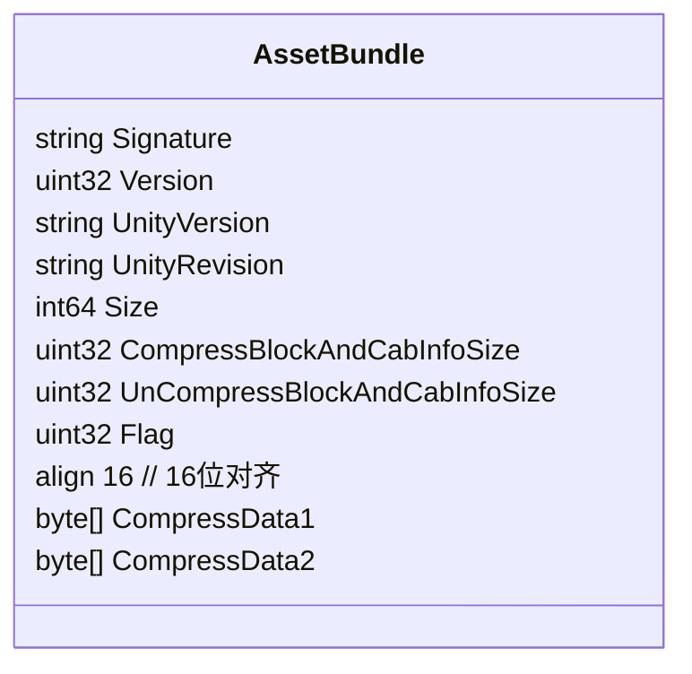
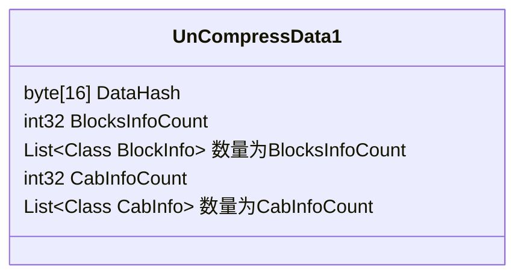
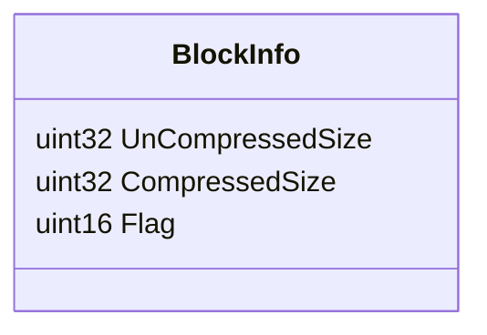
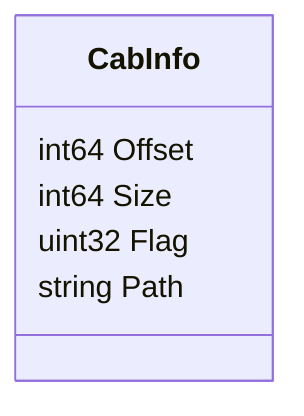
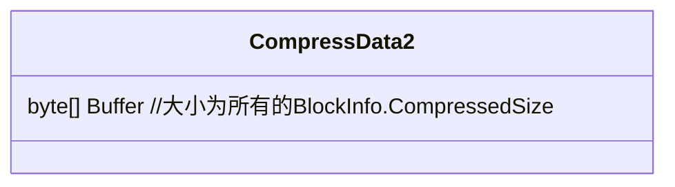
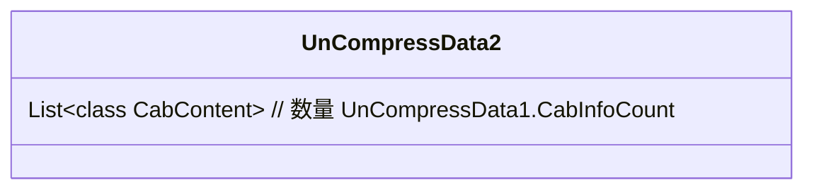
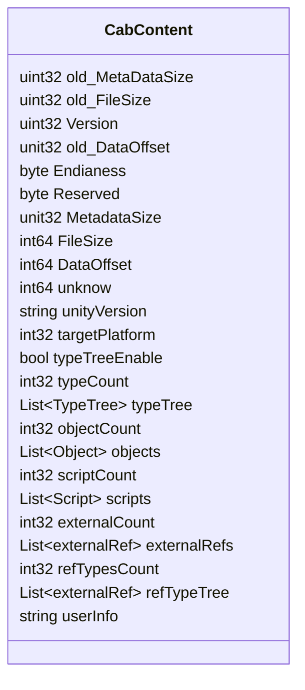

前段时间趁着工作需要，顺便把assetbundle的文件格式看了~在此做一下记录。

`CompressData1`解压后的格式`UnCompressData1`

使用前面得到的BlockInfo,对ComPressData2进行解压和重新生成
新的buffer

`CompressData2`解压后的格式`UnCompressData2`,解压后的`UnCompressData2`内容如下:

每个cab的大小在CabInfo中能找到(CabInfo.Size和CabInfo.Offset)

然后来看看CabContent

`All ObjectData`里存放的是`List<Object> objects`的数据！不同的文件格式就不一样！

