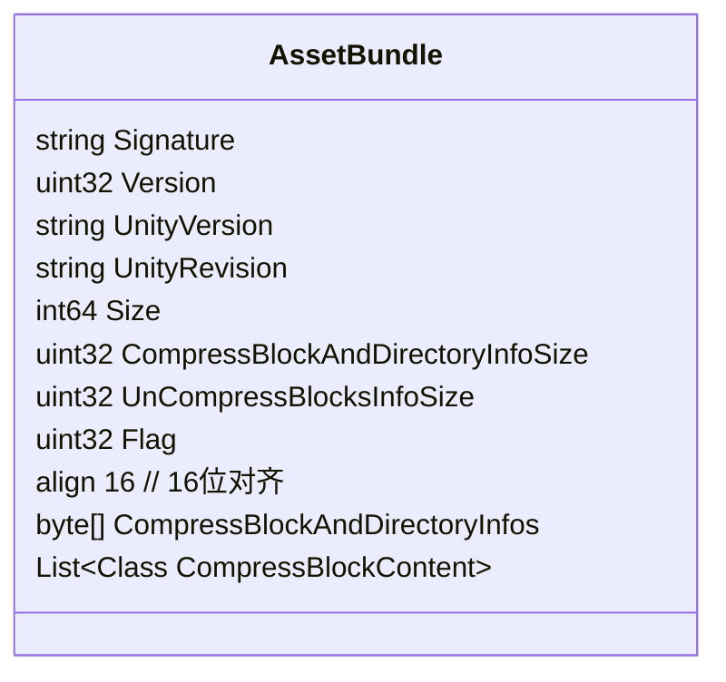
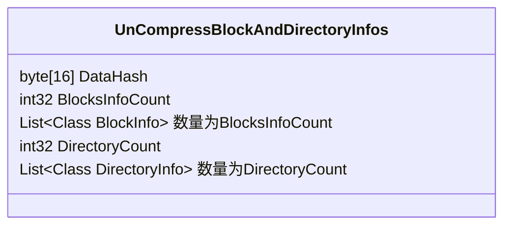
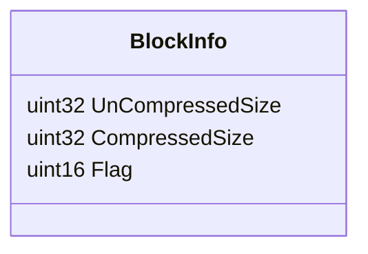
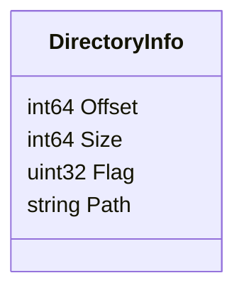
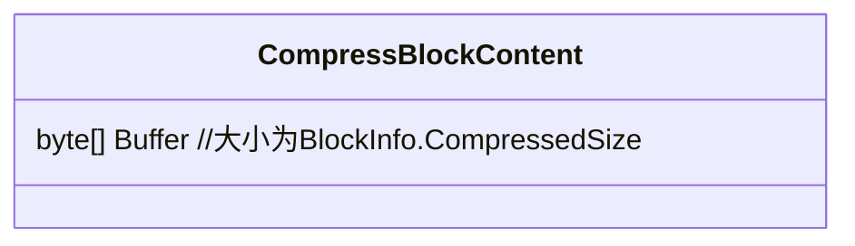
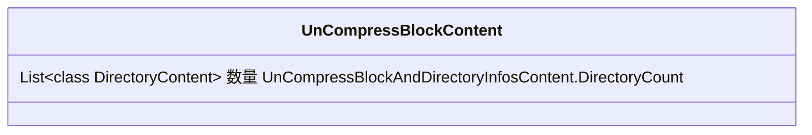

前段时间趁着工作需要，顺便把assetbundle的文件格式看了~在此做一下记录。

`List<Class CompressBlockContent>`是指有多个的意思，具体数量`CompressBlockAndDirectoryInfoSize`

`byte[] CompressBlockAndDirectoryInfos` 大小为`AssetBundle.CompressBlockAndDirectoryInfoSize`

`CompressBlockAndDirectoryInfos`解压后的格式`UnCompressBlockAndDirectoryInfos`

`CompressBlockContent`解压后的格式`UnCompressBlockContent`

