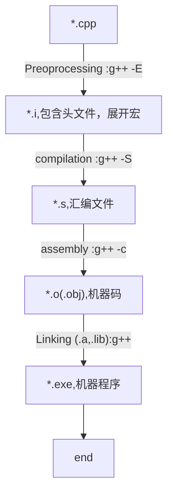

## 纲要

- C++的编译过程
- 编译环境

## C++的编译过程



如果使用的是gcc,需要指定一下`-lstdc++`,`gcc`和`g++`其中一个差别就`gcc`不会link标准库


gcc/g++ 头文件展开，宏替换、去注释

```
g++ -E hello.cpp -o hello.i
```
展开后，原本的代码放置在最后（保留行号，去注释）,如果不想去掉注释，可以结合`-C` (`C`是大写，小写有其他含义)使用


```
g++ -S hello.i -o hello.s
```
生成汇编文件


```
g++ -c hello.s -o hello.o
```
生成二进制文件


```
g++ hello.o -o hello
```
生成执行文件

> 以上需要注意的，并不是一定要经过`g++ -E`和`g++ -S`才能执行`g++ -c`生成*二进制*文件的，可以直接使用`g++ -c`生成的，其他的*汇编文件*之类的也是一样。

## 编译环境

- `msys2`
- `gcc/g++`
- Windows环境
- makefile

### msys2

在这篇幅里就不直接说`IDE`的，关注的是比较原始的方式。

由于目前是基于`windows`下的，所以使用的是`msys2`环境；

#### 安装和使用`msys2`

从[http://www.msys2.org/](http://www.msys2.org/)下载`MSYS2`。

安装后，最好更新所有软件包。使用以下命令更新所有内容：

```pacman
pacman -Syu
```

#### 镜像

如果当前网络更新或者下载较慢，可以考虑跟换镜像地址。三个文件`mirrorlist.mingw32`、`mirrorlist.msys`、`mirrorlist.mingw64`

`mirrorlist.mingw32`

```
# C:\msys64\etc\pacman.d\mirrorlist.mingw32
##
## 32-bit Mingw-w64 repository mirrorlist
##

## Primary
##中国科学技术大学开源软件镜像
Server = http://mirrors.ustc.edu.cn/msys2/mingw/i686
##北京理工大学镜像
Server = http://mirror.bit.edu.cn/msys2/mingw/i686
##日本北陆先端科学技术大学院大学 sourceforge 镜像
Server = http://jaist.dl.sourceforge.net/project/msys2/REPOS/MINGW/i686
##The UK Mirror Service Sourceforge mirror
Server = http://www.mirrorservice.org/sites/download.sourceforge.net/pub/sourceforge/m/ms/msys2/REPOS/MINGW/i686
## Primary
Server = ftp://148.251.42.38/MINGW/i686
## Sourceforge.net
Server = http://downloads.sourceforge.net/project/msys2/REPOS/MINGW/i686

## msys2.org
Server = http://repo.msys2.org/mingw/i686/
Server = https://sourceforge.net/projects/msys2/files/REPOS/MINGW/i686/
Server = http://www2.futureware.at/~nickoe/msys2-mirror/mingw/i686/
Server = https://mirror.yandex.ru/mirrors/msys2/mingw/i686/
```

`mirrorlist.msys`

```
# C:\msys64\etc\pacman.d\mirrorlist.msys
##
## MSYS2 repository mirrorlist
##

## Primary
##中国科学技术大学开源软件镜像
Server = http://mirrors.ustc.edu.cn/msys2/msys/$arch
##北京理工大学镜像
Server = http://mirror.bit.edu.cn/msys2/mingw/$arch
##日本北陆先端科学技术大学院大学 sourceforge 镜像
Server = http://jaist.dl.sourceforge.net/project/msys2/REPOS/MINGW/$arch
##The UK Mirror Service Sourceforge mirror
Server = http://www.mirrorservice.org/sites/download.sourceforge.net/pub/sourceforge/m/ms/msys2/REPOS/MSYS2/$arch
## Primary
Server = ftp://148.251.42.38/MSYS2/$arch
## Sourceforge.net
Server = http://downloads.sourceforge.net/project/msys2/REPOS/MSYS2/$arch

## msys2.org
Server = http://repo.msys2.org/msys/$arch/
Server = https://sourceforge.net/projects/msys2/files/REPOS/MSYS2/$arch/
Server = http://www2.futureware.at/~nickoe/msys2-mirror/msys/$arch/
Server = https://mirror.yandex.ru/mirrors/msys2/msys/$arch/
```

`mirrorlist.mingw64`

```
# C:\msys64\etc\pacman.d\mirrorlist.mingw64
##
## 64-bit Mingw-w64 repository mirrorlist
##

## Primary
##中国科学技术大学开源软件镜像
Server = http://mirrors.ustc.edu.cn/msys2/mingw/x86_64
##北京理工大学镜像
Server = http://mirror.bit.edu.cn/msys2/mingw/x86_64
##日本北陆先端科学技术大学院大学 sourceforge 镜像
Server = http://jaist.dl.sourceforge.net/project/msys2/REPOS/MINGW/x86_64
##The UK Mirror Service Sourceforge mirror
Server = http://www.mirrorservice.org/sites/download.sourceforge.net/pub/sourceforge/m/ms/msys2/REPOS/MINGW/x86_64
## Primary
Server = ftp://148.251.42.38/MINGW/x86_64
## Sourceforge.net
Server = http://downloads.sourceforge.net/project/msys2/REPOS/MINGW/x86_64

## msys2.org
Server = http://repo.msys2.org/mingw/x86_64/
Server = https://sourceforge.net/projects/msys2/files/REPOS/MINGW/x86_64/
Server = http://www2.futureware.at/~nickoe/msys2-mirror/mingw/x86_64/
Server = https://mirror.yandex.ru/mirrors/msys2/mingw/x86_64/
```

### gcc/g++

在`MSYS2 bash shell`中执行一下指令

```pacman
pacman -S base-devel gcc vim cmake
```

### Windows环境

上文中安装的`gcc/g++`都可以在`C\msys64\usr\bin`目录中找到许多`exe`文件。

如果需要在`window`下使用gcc之类的指令，只需要在`Path`中添加一下路径就可以了！

```cmd
C:\msys64\mingw64\bin
C:\msys64\usr\bin
```

### makefile

使用`gcc/g++`的时候，如果有大量的文件，那么在便利上就没有`make`来得爽了！

`makefile`基本格式如下：

```make
target ... : prerequisites ...
    command
    ...
```

|variable|description|
|---|---|
|target|目标文件, 可以是 Object File, 也可以是可执行文件|
|prerequisites|生成 target 所需要的文件或者目标|
|command|make需要执行的命令 (任意的shell命令)，如果其不与“target:prerequisites”在一行，那么，必须以[Tab]开头，如果和prerequisites在一行，那么可以用分号做为分隔|

make会比较targets文件和prerequisites文件的修改日期，如果prerequisites文件的日期要比targets文件的日期要新，或者target不存在的话，那么，make就会执行后续定义的命令。

比如前文我们生成的`hello`

```make
cc=g++
prom=hello
source=hello.cpp

$(prom):$(source)
	$(cc) -o $(prom) $(source)
```

在执行`make`指令后，我们能得到`make: “hello”已是最新。`。

现在对上面的`make`代码做一个基本的变量说明:

|自动变量|含义|
|--|--|
|$@	|目标集合
|$%	|当目标是函数库文件时, 表示其中的目标文件名
|$<	|第一个依赖目标. 如果依赖目标是多个, 逐个表示依赖目标
|$?	|比目标新的依赖目标的集合
|$^	|所有依赖目标的集合, 会去除重复的依赖目标
|$+	|所有依赖目标的集合, 不会去除重复的依赖目标
|$*	|这个是`GNU make`特有的, 其它的make不一定支持

再来一个例子，如果有多个文件，`eg`:`hello1.cpp`、`hello2.cpp`、`hello3.cpp`、`hello4.cpp`这4个文件，那么`makefile`就成为一下的样子

```make
cc=g++
prom=hello
source=hello1.cpp hello2.cpp hello3.cpp hello4.cpp

$(prom):$(source)
	$(cc) -o $(prom) $(source)
```

按这个指令，如果有一个文件修改，那么`make`就会编译所有的4个文件，如果更多的情况下，那岂不是每一次都会导致大量的编译~

通过前文的铺垫，知道从`*.cpp`到`exe`中间是经历了好几重处理的，所以如果保留最后一步生成的`*.o`（`*.obj`），这样能在引用的时候通过`link`就可以生成目标了。然后我们改一下`makefile`：

```make
cc=g++
prom=hello
source=hello1.o hello2.o hello3.o hello4.o

$(prom):$(source)
	$(cc) -o $(prom) $(source)

hello1.o:hello1.cpp
    $(cc) -c hello1.cpp -o hello1.o

hello2.o:hello2.cpp
    $(cc) -c hello2.cpp -o hello2.o

hello3.o:hello3.cpp
    $(cc) -c hello3.cpp -o hello3.o

hello4.o:hello4.cpp
    $(cc) -c hello4.cpp -o hello4.o

```
以上就能解决问题了，但是写法上有点麻烦。改造一下：

```make
cc=g++
prom=hello
source=hello1.o hello2.o hello3.o hello4.o
 
$(prom): $(source)
    $(cc) -o $(prom) $(source)
 
%.o: %.c
    $(cc) -c $< -o $@
```

上述的是不是简单了不少？至少不用每个文件都要写`.o`的生成，但是这里还有一个问题，那就是每个文件的`.o`都需要手动去添加，这个挺不爽的！

`makefile`是可以直接`shell`指令的！那么我们就可以改成以下模样:

```make
cc=g++
prom=hello
source=$(shell find ./ -name "*.c")
obj=$(src:%.c=%.o)
 
$(prom): $(obj)
    $(cc) -o $(prom) $(obj)
 
%.o: %.c
    $(cc) -c $< -o $@
```

这样我们就不需要手动添加`cpp`了！

> `$(src:%.c=%.o)`则是一个字符替换函数。